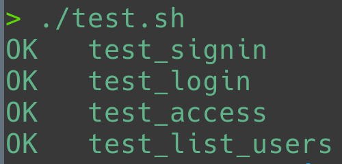

# gallery-backend



## API reference

### `POST /signin`

Enregistre un nouvel utilisateur.

```bash
curl "$BASE/signin" \
  --header 'Content-Type: application/json' \
  --request 'POST' \
  --data '{ "name": "alan", "email": "alan.turing@mail.uk" }'
```

### `POST /login`

Déclenche l'envoie d'un mail contenant le code d'authentification.

```bash
curl "$BASE/login" \
  --header 'Content-Type: application/json' \
  --request 'POST' \
  --data '{ "name": "alan" }'
```

### `POST /token`

Obtient un token d'authentification à partir du code reçu par mail.

```bash
curl "$BASE/token" \
  --header 'Content-Type: application/json' \
  --header 'Accept: application/json' \
  --request 'POST' \
  --data '{ "code": "..." }'
```

Réponse:
```json
{
  "access_token": "eyJ0oXA...SQ"
}
```

### `GET /users`

```bash
curl "$BASE/users" \
  --header 'Accept: application/json' \
  --header "Authorization: Bearer $TOKEN" \
  --request 'GET'
```

### `GET /albums`

```bash
curl "$BASE/albums" \
  --header 'Accept: application/json' \
  --header "Authorization: Bearer $TOKEN" \
  --request 'GET'
```

### `POST /albums`

```bash
curl "$BASE/albums" \
  --header 'Accept: application/json' \
  --header 'Content-Type: application/json' \
  --header "Authorization: Bearer $TOKEN" \
  --request 'POST' \
  --data '{"name": "..."}'
```

### `GET /albums/<slug>`

```bash
curl "$BASE/albums/$SLUG" \
  --header 'Accept: application/json' \
  --header "Authorization: Bearer $TOKEN" \
  --request 'GET'
```

### `DELETE /albums/<slug>`

```bash
curl "$BASE/albums/$SLUG" \
  --header "Authorization: Bearer $TOKEN" \
  --request 'DELETE'
```

### `GET /albums/<slug>/pics`

### `PATCH /albums/<slug>/pics`

### `GET /pic/<filehash>`

### `PUT /pic/<filehash>`

